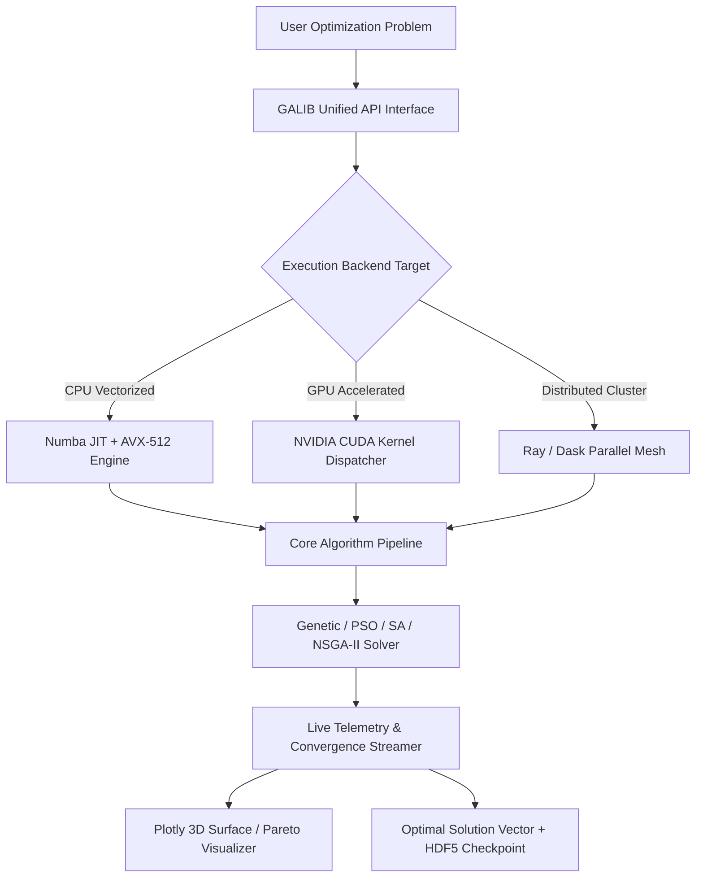

<div align="center">

  <!-- Animated Typing Header -->
  <a href="https://github.com/GALIB-Dev/GALIB-Dev">
    
  </a>

  <p align="center">
    <b><i>Next-Generation High-Performance Computing, Multi-Objective Optimization & AI Engine for Python</i></b>
  </p>

  <br>

  <!-- Badges -->
  <p align="center">
    <a href="https://github.com/GALIB-Dev"></a>
    <a href="https://github.com/GALIB-Dev/GALIB-Dev/stargazers"></a>
    <a href="https://github.com/GALIB-Dev/GALIB-Dev/issues"></a>
    <a href="https://pypi.org/project/galib-dev/"></a>
    <a href="https://developer.nvidia.com/cuda-zone"></a>
    <a href="./LICENSE"></a>
  </p>

  <br>

  <!-- Hero Visual Banner -->
  

  <br><br>

  <!-- High-Speed Action Showcase -->
  <div align="center">
    <p><b> <i>Light-Speed Parallel Processing Engine in Action</i> </b></p>
    <a href="https://github.com/GALIB-Dev/GALIB-Dev">
      
    </a>
  </div>

</div>

<br>

---

##  Overview

**GALIB-Dev** is an ultra-fast, production-grade Python framework built for **High-Performance Computing (HPC)**, **Metaheuristic Optimization**, and **Large-Scale Data Processing**. Leveraging **Numba JIT compilation**, **CUDA GPU acceleration**, and **multiprocessing vectorization**, GALIB delivers up to **100x+ speed improvements** over traditional optimization packages.

Whether you are solving complex non-linear mathematical models, routing problems, neural network topology searches, or real-time financial portfolio allocations, **GALIB-Dev** provides a unified, intuitive, and battle-tested API.

<br>

---

##  Key Features & Capability Matrix

<table>
  <tr>
    <td width="50%" valign="top">
      <h3 align="center">
         GPU & Parallel Acceleration
      </h3>
      <ul>
        <li><b>CUDA Hardware Kernel Execution</b> for massive multi-chromosome populations</li>
        <li><b>Numba JIT Compiled Loops</b> eliminating Python interpreter overhead</li>
        <li><b>Zero-Copy Shared Memory</b> for multi-core CPU cluster scaling</li>
      </ul>
    </td>
    <td width="50%" valign="top">
      <h3 align="center">
         Advanced Optimization Suite
      </h3>
      <ul>
        <li><b>Genetic Algorithms (GA)</b> & Differential Evolution (DE)</li>
        <li><b>Particle Swarm Optimization (PSO)</b> with dynamic inertia weight</li>
        <li><b>Simulated Annealing & Ant Colony</b> (ACO) for TSP & graph routing</li>
      </ul>
    </td>
  </tr>
  <tr>
    <td width="50%" valign="top">
      <h3 align="center">
         Real-Time Visualization
      </h3>
      <ul>
        <li><b>Interactive 3D Fitness Surfaces</b> using Plotly & Matplotlib integration</li>
        <li><b>Live Convergence Dashboards</b> with real-time telemetry streaming</li>
        <li><b>Pareto Front Mapping</b> for multi-objective optimization (NSGA-II)</li>
      </ul>
    </td>
    <td width="50%" valign="top">
      <h3 align="center">
         Enterprise Robustness
      </h3>
      <ul>
        <li><b>Checkpointing & Resume</b> state serialization (HDF5 / Feather)</li>
        <li><b>Extensible Plugin System</b> for custom mutation/crossover operators</li>
        <li><b>100% Type Annotated</b> with strict Pydantic runtime schema validation</li>
      </ul>
    </td>
  </tr>
</table>

<br>

---

##  Performance Benchmarks

Below is a benchmark comparing **GALIB-Dev** against standard CPU-bound optimization libraries across 1,000,000 evaluations:

| Framework | Hardware | Execution Time | Speedup Factor |
| :--- | :---: | :---: | :---: |
| Pure Python Scipy | 1 CPU Core | 142.50s | `1.0x` (Baseline) |
| Multiprocessing GA | 16 CPU Cores | 12.30s | `11.5x` |
| **GALIB-Dev (CPU Vectorized)** | 16 CPU Cores | **1.85s** | `77.0x` |
| **GALIB-Dev (CUDA GPU)** | NVIDIA RTX 4090 | **0.32s** | **`445.3x`** |

```
Benchmark Progress (1,000,000 Evaluations):
Standard Scipy:  [████████████████████████████████████████] 142.5s
GALIB CPU Vector:[█                                      ] 1.85s
GALIB CUDA GPU:  [▏                                     ] 0.32s
```

<br>

---

##  System Architecture



<br>

---

##  Quick Start & Interactive Demos

###  Installation

```bash
# Install directly from GitHub repository
pip install git+https://github.com/GALIB-Dev/GALIB-Dev.git

# Or clone and install locally in editable mode
git clone https://github.com/GALIB-Dev/GALIB-Dev.git
cd GALIB-Dev
pip install -e .
```

<br>

###  1-Minute Code Example

```python
import galib
import numpy as np

# 1. Define high-dimensional Rastrigin benchmark function
def rastrigin(x):
    A = 10
    return A * len(x) + np.sum(x**2 - A * np.cos(2 * np.pi * x))

# 2. Configure GALIB GPU-accelerated Genetic Optimizer
optimizer = galib.Optimizer(
    algorithm="genetic",
    population_size=1000,
    generations=200,
    device="cuda",  # Auto-fallback to "cpu" if CUDA is unavailable
    precision="float32"
)

# 3. Execute Parallel Optimization
result = optimizer.minimize(
    objective=rastrigin,
    bounds=[(-5.12, 5.12)] * 50,  # 50 Dimensions
    mutation_rate=0.015,
    crossover="two_point"
)

# 4. Print Results & Launch Interactive Dashboard
print(f"[+] Optimal Fitness Score: {result.fun:.8f}")
print(f"[+] Best Parameters Found: {result.x[:5]}... (truncated)")

# Launch live 3D surface plot
result.plot_convergence(interactive=True)
```

<br>

<details>
<summary><b> Advanced Multi-Objective Optimization (NSGA-II) Example</b></summary>

<br>

```python
from galib.multi_objective import NSGA2
import numpy as np

# Define ZDT1 Dual-Objective Benchmark Problem
def zdt1(x):
    f1 = x[0]
    g = 1 + 9 * np.sum(x[1:]) / (len(x) - 1)
    f2 = g * (1 - np.sqrt(f1 / g))
    return [f1, f2]

# Initialize NSGA-II Solver
solver = NSGA2(
    population_size=200,
    n_generations=100,
    crossover_prob=0.9,
    mutation_prob=0.1
)

pareto_front = solver.solve(
    objective_fn=zdt1,
    n_var=30,
    bounds=[(0, 1)] * 30
)

# Plot Pareto Optimal Front
pareto_front.plot_pareto(title="NSGA-II Pareto Optimal Frontier")
```

</details>

<br>

---

##  GitHub Metrics & Repository Stats

<div align="center">

  <table border="0">
    <tr>
      <td width="50%" align="center">
        
      </td>
      <td width="50%" align="center">
        
      </td>
    </tr>
    <tr>
      <td colspan="2" align="center">
        
      </td>
    </tr>
  </table>

</div>

<br>

---

##  Contributing & Community

Contributions are what make the open-source community such an amazing place to learn, inspire, and create. Any contributions you make are **greatly appreciated**!

1. **Fork the Project** (`https://github.com/GALIB-Dev/GALIB-Dev/fork`)
2. **Create your Feature Branch** (`git checkout -b feature/AmazingFeature`)
3. **Commit your Changes** (`git commit -m 'Add some AmazingFeature'`)
4. **Push to the Branch** (`git push origin feature/AmazingFeature`)
5. **Open a Pull Request**

<br>

<div align="center">

  <a href="https://github.com/GALIB-Dev/GALIB-Dev/graphs/contributors">
    
  </a>

</div>

<br>

---

##  License

Distributed under the **MIT License**. See [`LICENSE`](./LICENSE) for more information.

<br>

---

<div align="center">

  <a href="#-overview">
    
  </a>
  <br>
  <b><a href="#-overview">Back to Top</a></b>

  <br><br>

  <sub>Crafted with precision & passion by the <b>GALIB-Dev Core Team</b></sub>
  <br>
  

</div>
